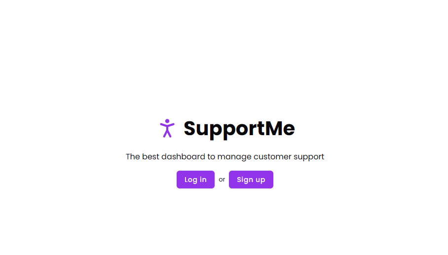
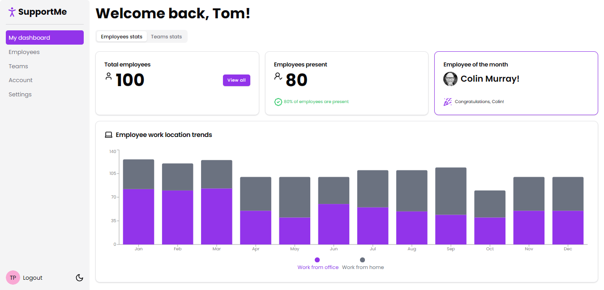

## Getting Started

First, run the development server:

```bash
npm run dev
# or
yarn dev
# or
pnpm dev
# or
bun dev
```

Open [http://localhost:3000](http://localhost:3000) with your browser to see the result.

You can start editing the page by modifying `app/page.tsx`. The page auto-updates as you edit the file.

## Imagens

### Página de boas vindas


### Página principal


## Descrição

Neste projeto foram utilizadas tecnologias como [**NextJs**](https://nextjs.org) & [**Shadcn/ui**](https://ui.shadcn.com) & [**Tailwind**](https://tailwindcss.com).

O site foi idealizado seguindo o curso: 
**[shadcn ui - build dashboards with shadcn ui components, including shadcn ui, tailwindcss, and Next JS](https://www.udemy.com/course/shadcn-ui)**